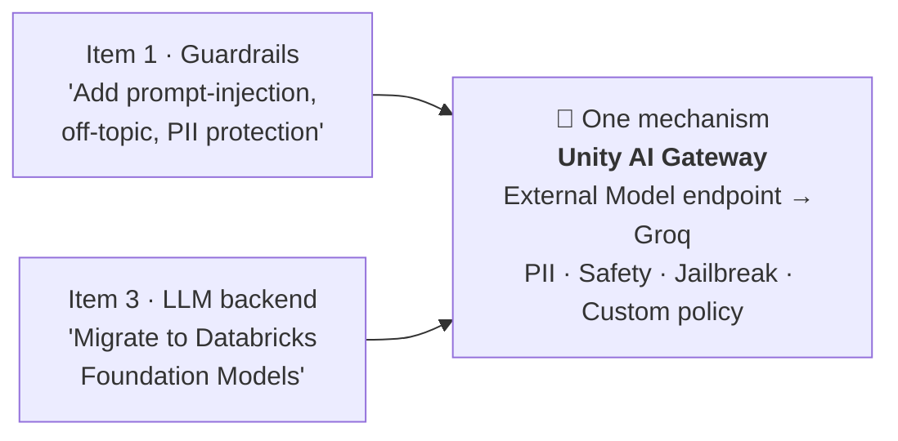
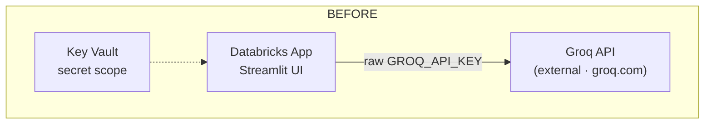
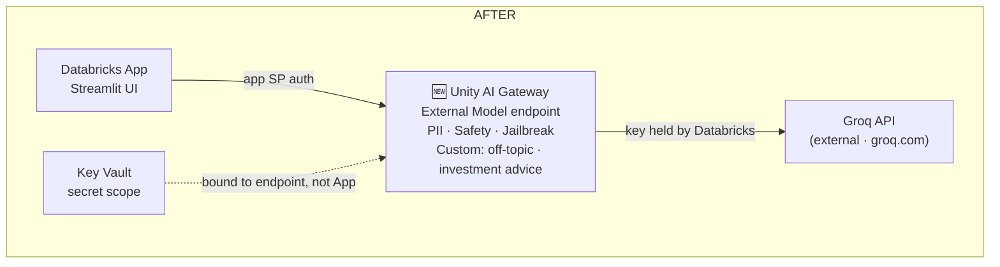
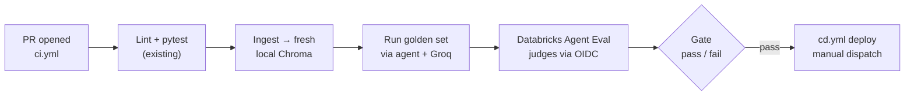

# PolicyPilot Upgrade Plan

**Four decisions, two reversals** — 2026-09-02

We set out to plan four upgrades: guardrails, smarter ticker detection with more data, a
move to Databricks Foundation Models, and a choice between Databricks Agent Evaluation and
the existing MLflow harness. Working through each one surfaced that **two of the four
collapse into a single underlying fix**, and one original ask gets explicitly reversed. This
document records what changed, why, and what to build in what order.

## Status ledger

| # | Original ask | Landed on | Status |
|---|---|---|---|
| 1 | Add guardrails — prompt injection, off-topic, and other protections | Unity AI Gateway wrapping the deployed Groq call | **Revised** |
| 2 | Smarter ticker detection + ingest ≥25MB of data | LLM-based detection in `plan_node`; scale by breadth to ~15–20 tickers | **Confirmed** |
| 3 | Use Databricks Foundation Models in the deployed architecture | Keep Groq everywhere — Databricks provides governance, not inference | **Reversed** |
| 4 | Decide: Databricks Agent Evaluation vs. MLflow | Databricks Agent Evaluation, run in CI as a deploy gate; custom MLflow harness retired | **Confirmed** |

## 00. The collapse

Items 1 and 3 were scoped as separate workstreams. They turned out to be the same fix,
because of one fact about how Databricks' governance layer actually works.

Unity AI Gateway — the layer that provides PII detection, content safety, and jailbreak /
prompt-injection filtering — isn't limited to Databricks-hosted Foundation Models. It can
also front an **External Model endpoint** that proxies to a third-party provider like Groq.
So "get guardrails" never actually required "switch LLM providers" — it only required
putting Databricks' gateway in front of the LLM call, whichever provider sits behind it.

*Two separately-scoped items, one underlying change: wrap the existing Groq call in
Databricks' gateway.*

That single finding is what produced both this document's reversal (item 3) and its
revision (item 1) — each is detailed below with the research that led there.

---

## 01. Guardrails — **Revised**

| | |
|---|---|
| **Asked** | Prompt injection, off-topic, and "other necessary" guardrails. |
| **Landed on** | All of it lives in a Unity AI Gateway External Model endpoint, deployed-only. No new LangGraph node. |
| **Covers** | PII detection/redaction, content safety, jailbreak / prompt-injection detection (built-in categories) — plus two **custom guardrails** written as plain-language policy prompts: off-topic questions, and requests for investment/trading advice. |

### Why it moved out of the agent

The first plan put a new `guard_node` in front of `plan_node`, running its own LLM
classification call. That's a reasonable pattern on its own, but once we confirmed AI
Gateway's built-in jailbreak detector and custom-prompt guardrails cover the same ground,
keeping a parallel implementation in the agent meant maintaining one policy in two places —
Python code and Databricks config — that could drift out of sync. Centralizing at the
gateway also removes an LLM round-trip from every question's latency.

### What we explicitly did not adopt

[Shieldstral](https://mistral.ai/news/shieldstral/), Mistral's open-weights 3B safety
classifier, is a genuinely good technical fit for the off-topic / investment-advice checks
— it's built exactly for policy-adaptive yes/no classification. It's parked as a future
option because it needs its own GPU-hosted endpoint (Databricks Model Serving with a GPU),
which is new always-on infrastructure — the same kind of billable resource this project has
otherwise been careful to tear down between test sessions.

> **Accepted gap** — Local dev (`PP_ENV=local`, raw Groq) has zero guardrails — AI Gateway
> only sits in front of the deployed path. Treated as acceptable: local is a developer
> sandbox, never exposed to untrusted users. See [Known gaps](#07-known-gaps) for the
> test-coverage consequence.

---

## 02. Ticker detection & data scale — **Confirmed**

| | |
|---|---|
| **Asked** | Smarter ticker detection; ingest ≥25MB of data. |
| **Landed on** | Fold detection into `plan_node`'s existing LLM call; scale data by adding companies, not history or filing types. |

### Ticker detection

Today's `plan_node` matches the question's words against a hardcoded
`DEFAULT_TICKERS = ["AAPL","MSFT","JPM"]` list — exact symbol only, so "Apple" doesn't
match but "AAPL" does. `plan_node` already makes one LLM call to rewrite the question into
a search query; that same call will also return a detected company or ticker if one is
named, by symbol *or* name. No new call, and it scales to however many companies get
ingested without touching code.

### Data scale — breadth over history or filing types

Three ways to cross 25MB were on the table: more companies, more years per company, or more
filing types (10-Q, 8-K) alongside the 10-Ks. Breadth won: expand `DEFAULT_TICKERS` from 3
to roughly 15–20 well-known tickers, one 10-K each. It directly stress-tests the smarter
detection above, and doesn't require new metadata dimensions (fiscal year disambiguation,
filing-type schema) the other two axes would need.

> **Follow-on** — `golden_dataset.jsonl` (currently 13 questions across 3 tickers) should
> grow alongside the ticker list to keep eval coverage proportional.

---

## 03. LLM backend — **Reversed**

| | |
|---|---|
| **Asked** | Use Databricks Foundation Models in the deployed architecture. |
| **Landed on** | Keep Groq as the LLM everywhere — local *and* deployed. Databricks' role becomes governance, not inference. |

### The two real patterns, compared honestly

**Groq + AI Gateway wrapper** optimizes for speed and provider flexibility — the same shape
as putting LiteLLM or Portkey in front of a best-of-breed external API, which is the more
common industry pattern outside Databricks-native shops. Groq's LPU inference is
meaningfully faster than standard GPU-served Foundation Models.

**Full Foundation Model migration** optimizes for data residency: every request, including
retrieved 10-K text, would stay entirely inside the Databricks/Azure boundary — nothing
leaves to a third-party API. For a product branded a "*governed* regulatory/policy
copilot," that's not cosmetic. It's also the on-ramp to Mosaic AI Agent Framework and Model
Serving later.

### Why Groq won anyway

The migration's main justification — unlocking guardrails — evaporated once External Model
endpoints turned out to support the exact same guardrail categories as Foundation Model
endpoints. What's left is the residency argument alone, and today's corpus is entirely
public SEC filings with no confidentiality requirement to protect. Shipping the governance
win now, honestly, beats migrating models for a compliance property this specific dataset
doesn't yet need.

> **Named, not dropped** — "Governed" is redefined here as *monitored and filtered*, not
> *data never leaves our boundary*. Full Foundation Model migration stays on the table as a
> distinct future step if the corpus or audience ever changes that calculus.

---

## 04. Evals — **Confirmed**

| | |
|---|---|
| **Asked** | Databricks Agent Evaluation or MLflow — pick one. |
| **Landed on** | Databricks Agent Evaluation, run in CI, gating `cd.yml`. The custom `run_eval.py` harness is retired. |

### Why not split by environment, like everything else

Every other backend in this project splits cleanly by `PP_ENV` — `VectorStore` and
`LLMClient` both swap without the agent code changing. Evals looked like a candidate for
the same pattern: custom MLflow judge locally, Databricks Agent Evaluation once deployed.
It's the wrong pattern here for a specific reason — an eval harness's job is to gate a
release, and two different judges scoring the same question differently means local "pass"
stops predicting deployed "pass." That's training/serving skew, applied to quality gates
instead of model weights.

### Why CI, not local

Databricks Agent Evaluation's built-in judges (groundedness, safety, relevance, guideline
adherence) run as Databricks-hosted models — it needs `mlflow[databricks]>=3.1` and live
workspace connectivity, which would break the "no cloud account needed locally" promise if
run interactively. Moving it into CI sidesteps that: interactive local dev (asking
questions in the chat UI) stays fully offline, and the eval-as-gate concept fits CI
naturally. The existing GitHub OIDC federation (already used by `cd.yml`) covers the
Databricks auth — no new secret needed for that part.

---

## 05. Target architecture

The deployed request path, before this plan and after it. The only structural addition is
the gateway hop.

*The provider key moves from the App's environment to the gateway endpoint's config — app
code no longer touches a raw Groq key at all.*

---

## 06. Delivery sequence

The four items aren't independent. Build in this order to keep each step protected by the
one before it.

1. **Item 2 first** — ticker/company detection in `plan_node` and the expanded ingestion.
   Lowest risk, no new infrastructure, and every later step benefits from more data to test
   against.
2. **Item 4 second** — CI-gated Databricks Agent Evaluation, using the now-larger
   `golden_dataset.jsonl`. Runs entirely against a freshly-rebuilt local Chroma store, so it
   has **no dependency** on items 1 or 3 — it can ship before the gateway work even starts.
3. **Items 1 + 3 together, last** — both resolve to the same Unity AI Gateway change, and
   it's the highest-risk, most novel piece (a new Databricks resource type, a changed
   deployed `LLMClient` path). By this point it's protected by the eval gate from step 2
   before it ever reaches `cd.yml`.

*Evaluation happens entirely against a local, ephemeral store — no Databricks Vector
Search endpoint has to stay running for CI to check a PR.*

---

## 07. Known gaps

Named rather than hidden. None of these block the plan above — they're the honest edges of
it.

- **Guardrails have no automated test coverage.** They live entirely in AI Gateway, which
  only applies to the deployed path; the CI eval gate (item 4) runs against local Chroma +
  raw Groq, so it never exercises them. A small deployed-environment smoke test — known
  injection/off-topic/investment-advice probes against the live gateway endpoint — is the
  natural next addition, not covered by this plan.
- **`ci.yml` needs two things it doesn't have yet:** a `GROQ_API_KEY` secret (to run the
  agent against the golden set) and an Azure OIDC login step mirroring `cd.yml`'s (to reach
  Databricks Agent Evaluation's hosted judges). Today `ci.yml` only runs `ruff` and
  `pytest`, with no cloud credentials at all.
- **Local dev stays guardrail-free by design.** Acceptable for a single-developer sandbox
  never exposed to untrusted users — but worth re-checking if this project ever grows a
  second local user.
- **Full Foundation Model migration is deferred, not cancelled.** If the corpus ever
  includes non-public or confidential material, the data-residency argument for item 3
  comes back into play and this decision should be revisited.

---

*src/policypilot — decisions resolved via interview, 2026-09-02*
